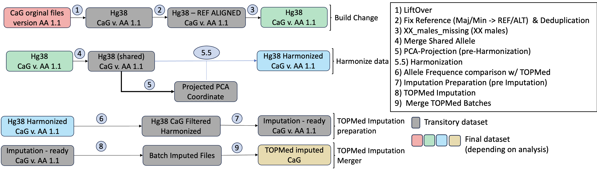

# Genotype processing 
 
## About
this folder contains the repository for all code and explanation regarding the processing of the array genotyping of CARTaGENE (CaG). This will encompass the liftover to the imputation preparation. We will to detail and document each step separately.

## Workflow

